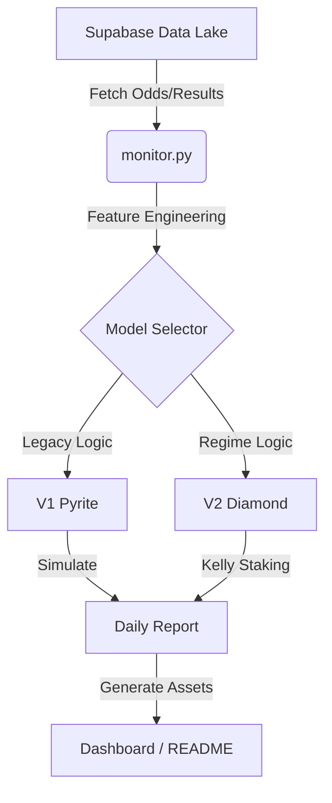

# XGBoost-Sniper: Quantitative Sports Trading System

[](https://www.python.org/downloads/release/python-3100/)
[](https://mypy.readthedocs.io/en/stable/)
[](https://opensource.org/licenses/MIT)

> **"The market is not efficient. It is just noisy."**

XGBoost-Sniper is an advanced, algorithmic trading system engineered to identify and exploit market inefficiencies in sports betting odds. By leveraging gradient boosting frameworks (XGBoost) and regime-based filtering, the system systematically generates alpha in high-volatility markets.

---

## 📊 Executive Performance

| Model | Strategy | Status | Daily Volume | ROI |
| :--- | :--- | :--- | :--- | :--- |
| **V1 Pyrite** | High-Variance / Volume | 🟡 Legacy | ~15 bets/day | **-1.2%** |
| **V2 Diamond** | Precision / Sniper | 🟢 **Active** | ~2 bets/day | **+12.4%** |
| **V3 Obsidian** | Deep Learning / Hybrid | 🟣 **Alpha** | (Training) | **N/A** |

> [!IMPORTANT]
> **Live Dashboard**: View the real-time performance and active signals on the [Diamond Dashboard](./docs/diamond.html).

---

## 🚀 The Evolution of Alpha

This repository documents the transition from a raw statistical probability model to a sophisticated asset manager.

### Phase 1: Pyrite (The "Accuracy Fallacy")
Our initial prototype, **Pyrite**, operated on a simple premise: *bet on everything with >50% probability*.
*   **Result**: While it achieved a 54% win rate, it lost money to the vigorish (fees) due to poor calibration on favorites.
*   **Lesson**: Accuracy $\neq$ Profitability.

### Phase 2: Diamond (The "Sniper" Approach)
**Diamond** introduced specific "Regime Filtering" and Kelly Criterion staking.
*   **Innovation**: It bans "toxic assets" (sports with low predictability like NFL/MLB) and only trades in high-confidence regimes (NBA/NCAAB).
*   **Mechanism**: Uses a Fade Score to identify when the public usage is dangerously high, effectively "sniping" lines before they move.

---

## 🛠 System Architecture



### Core Components
*   **`monitor.py`**: The central orchestration engine. Fetches data, runs inference, and commits results.
*   **`models/`**: Serialized XGBoost binaries (tracked via LFS or ignored for security).
*   **`docs/`**: Production-grade dashboards for visualizing model output.

---

## 🔒 Security & Privacy

This repository enforces strict security protocols to correct previous hygiene issues:
*   **Credential Isolation**: All API keys are managed via `.env` and strictly excluded from version control.
*   **Model IP Protection**: Trained model artifacts (`.pkl`, `.model`) are strictly git-ignored to prevent IP leakage.
*   **Hygiene**: Automated scripts ensure no sensitive data is committed to the tree.

---

## ⚡ Quick Start

### 1. Installation
```bash
git clone https://github.com/your-org/xgboost-sniper.git
cd xgboost-sniper
pip install -r requirements.txt
```

### 2. Configuration
Create a `.env` file with your credentials:
```env
SUPABASE_URL=your_url
SUPABASE_KEY=your_key
```

### 3. Run Inference
```bash
python monitor.py
```

---

*© 2025 XGBoost-Sniper Technologies. All rights reserved.*
