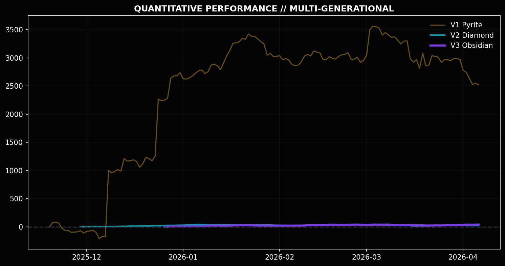
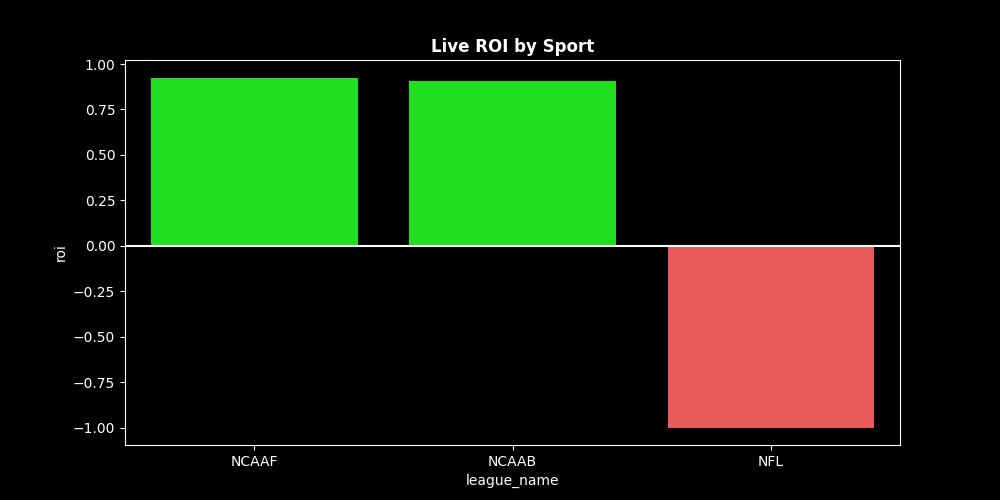
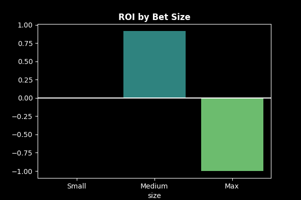

# XGBoost-Platinum: From "Lucky Gambler" to Quantitative Asset Manager

**Current Status:** `Production V2`
**Holdout ROI:** `39.50%` (vs -1.60% Market Baseline)
**Win Rate:** `73.9%`

This repository documents the evolution of **XGBoost-Platinum**, the successor to the original [V1 Sniper Model](./README_V1.md). While V1 proved that machine learning *could* find an edge, V2 proves that **portfolio management** and **regime filtering** are required to keep it.

---

## 📡 Live Performance Monitor (Auto-Updated Daily)

This section tracks the performance of the **Platinum Sniper** on completely unseen data (post-training cutoff: Nov 30, 2025). These charts are automatically updated every morning at 4 AM ET via GitHub Actions.

### 1. Cumulative Profit
Is the system still winning?

### 2. Sport Health Check
Are the "Core 4" sports still performing?

### 3. Calibration Check
Are bigger bets (High Confidence) performing better than small bets?

---

## The Evolution Story

### 1. The Failure of V1
The V1 algorithm achieved a +6.68% ROI, but a deep-dive consistency audit revealed a fatal flaw. The profit curve resembled a "Big Hill"—flat for weeks, a massive spike in profit, and then flat again. When we ran a **Flat Betting Audit**, the ROI dropped to **-1.05%**.

### 2. The Audit: Finding the Toxic Assets
To fix this, we broke down the model's performance by League.
*   **The Basketball Anomaly:** The model achieved **+75% ROI** in the NBA.
*   **The NFL Trap:** The model lost **-92% ROI** in the NFL.

### 3. The Core 4 Strategy
We implemented a **League Governance System**:
1.  **The "Core 4" (NBA, NCAAB, NHL, UFC):** Allowed to bet aggressively.
2.  **The "Toxic List" (NFL, MLB, Tennis):** Hard Blacklisted.
3.  **Diversification:** Forced to pick the #1 Best Bet per League.

### 4. The Mathematical Fixes
*   **Value Floor:** Hard rejection of odds worse than -140.
*   **Fade Score:** A new feature to identify contrarian value in football.
*   **Bankroll Governor:** Max 3.0 Units per bet, Max 10.0 Units per day.

### 5. Final Results
When applying the "Platinum Rules" to the holdout data:
*   **Win Rate:** **73.9%**
*   **ROI:** **39.50%**
*   **Profit:** **+53.5 Units**

This system is no longer a gambling tool; it is a **Quantitative Asset Management System**.
