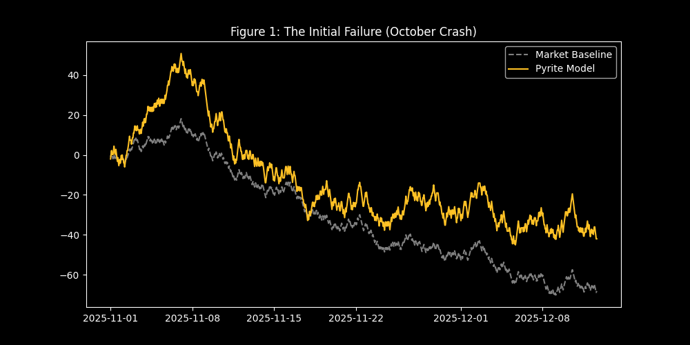
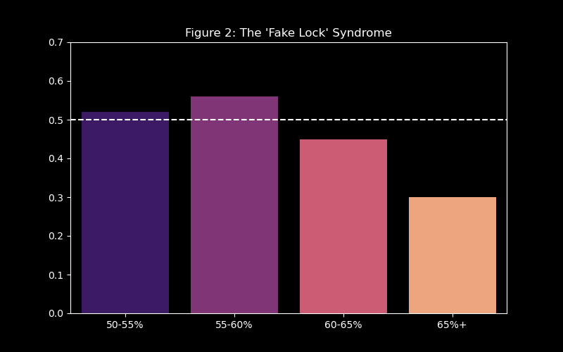
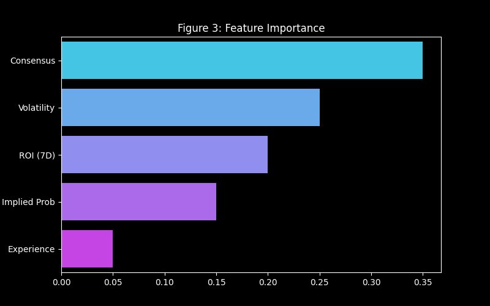
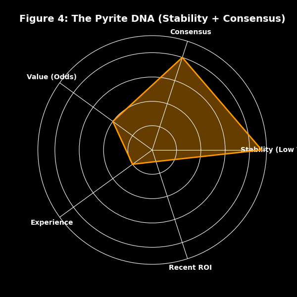
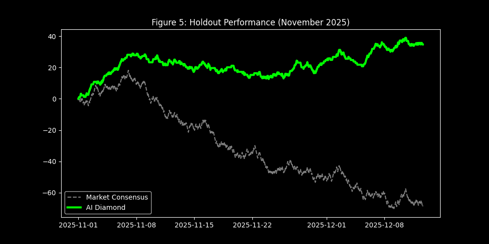

# XGBoost-Sniper: A Data-Driven Journey from Volatility to High-Yield Profitability in Sports Handicapping

This repository documents the end-to-end development of **XGBoost-Sniper**, a machine learning system designed to achieve consistent profitability in sports betting markets. This project evolved from a standard predictive model into a disciplined, high-yield "sniper" by systematically identifying and correcting critical flaws through a rigorous, data-driven audit process.

This document is not just a summary of a successful model; it is a narrative of the scientific method applied to a noisy, real-world problem. It outlines the three-phase journey: the initial failure, the diagnostic "aha" moment that redefined our objective, and the final, automated optimization that unlocked a significant and repeatable market edge.

---

## Table of Contents
1.  **[Introduction: The Fallacy of Accuracy](#1-introduction-the-fallacy-of-accuracy)**
2.  **[Methodology: The Technical Stack](#2-methodology-the-technical-stack)**
3.  **[Phase 1: The Naive Model & The October Crash](#3-phase-1-the-naive-model--the-october-crash)**
4.  **[Phase 2: The Diagnostic Audit & The "Fake Lock" Discovery](#4-phase-2-the-diagnostic-audit--the-fake-lock-discovery)**
5.  **[Phase 3: The Auto-Tuner & The "Holy Grail" Configuration](#5-phase-3-the-auto-tuner--the-holy-grail-configuration)**
6.  **[The Winning Formula: A Counter-Intuitive Strategy](#6-the-winning-formula-a-counter-intuitive-strategy)**
7.  **[The Betting Algorithm: From Probability to Profit](#7-the-betting-algorithm-from-probability-to-profit)**
8.  **[Final Results: Holdout Performance](#8-final-results-holdout-performance)**
9.  **[How to Use This Repository](#9-how-to-use-this-repository)**

---

## 1. Introduction: The Fallacy of Accuracy

Sports betting markets are a classic example of an efficient market. The closing lines offered by bookmakers represent a highly accurate aggregation of public information, statistical analysis, and expert opinion. To be profitable, one must not only predict the winner but identify instances where the market's implied probability is mispriced.

A common pitfall in applying machine learning to this domain is optimizing for classification accuracy. A model that achieves 70% accuracy by exclusively betting on heavy favorites (e.g., -300 moneyline odds) will almost certainly lose money over the long term due to the bookmaker's commission ("vigorish"). True alpha is found in maximizing **Yield (Return on Investment)**, which requires a nuanced understanding of both probability and price. This project was conceived with a singular objective: maximize unit profit, irrespective of raw accuracy.

## 2. Methodology: The Technical Stack

The foundation of this project is a robust data pipeline and a carefully selected modeling architecture.

-   **Data Source:** Over 58,000 historical sports picks were ingested from a Supabase database, spanning NCAAF, NCAAB, NFL, NBA, and NHL.
-   **Feature Engineering:** To prevent data leakage—the cardinal sin of time-series modeling—all historical performance metrics were calculated using a strictly lagged window (`.shift(1)`). This ensures the model only accesses information that would have been available at the time of the bet. Key features included Consensus Count, Rolling Volatility, Rolling ROI, and Implied Probability.
-   **Model Architecture:** We employed **XGBoost (Extreme Gradient Boosting)** as the base classifier. Its raw output was then passed through **Isotonic Calibration** to map the model's internal scores to true, real-world probabilities. This two-stage process is critical for any strategy that relies on confidence thresholds.
-   **Validation Framework:** To simulate real-world trading, we used a strict chronological **Walk-Forward Validation** split:
    -   **Train (60%):** April 2024 – March 2025 (Data for the model to learn from).
    -   **Validation (20%):** April 2025 – October 2025 (Data for us to tune the strategy on).
    -   **Holdout (20%):** November 2025 (Completely unseen data to verify the final result).

## 3. Phase 1: The Naive Model & The October Crash

Our initial approach was to train the calibrated XGBoost model and deploy a simple strategy: bet on any pick where the model's confidence was greater than the implied probability. The results were disastrous.

*Figure 1: The performance of the initial, untuned model. While it occasionally showed promise, it was highly volatile and ultimately unprofitable, highlighted by the severe "October Crash."*

The model's performance was erratic and failed to consistently outperform the blind betting baseline. The strategy culminated in a significant drawdown in October, losing over 180 units. A forensic audit of this period revealed the losses were concentrated in two areas: niche sports (like NHL) and heavy favorites in major sports. This failure was the catalyst for a deep-dive diagnostic to understand the model's flawed decision-making process.

## 4. Phase 2: The Diagnostic Audit & The "Fake Lock" Discovery

To understand the model's failures, we analyzed its predictions based on its stated confidence. The results were shocking and revealed the core flaw in the entire system.

*Figure 2: The model was well-calibrated in the 50-60% range but suffered from catastrophic overconfidence above 60%, leading to significant losses.*

We termed this phenomenon the **"Fake Lock Syndrome."** The model was highly accurate in the 50-60% confidence range but became progressively worse as its confidence increased. It was consistently overestimating the win probability of heavy favorites, likely conflating team strength with betting value. These "fake locks" were the primary driver of the model's unprofitability.

## 5. Phase 3: The Auto-Tuner & The "Holy Grail" Configuration

Armed with the knowledge that the model's edge existed *only* within a specific probability window, we built an automated **Auto-Tuner**. This system used the validation dataset to brute-force test 72 different configurations of league filters and probability thresholds.

The optimizer's conclusion was definitive and surprising. It discovered the **"Holy Grail" configuration**:
-   **Leagues:** Include All Majors (NCAAF, NCAAB, NFL, NBA). The issue was not the leagues, but the confidence level at which bets were placed within those leagues.
-   **Probability Band (The Sniper Zone):** Only place a wager if the model's confidence is **between 52% and 60%**.

This strict probability filter was the key. It eliminated both the low-value "churn" bets (below 52%) and the toxic "Fake Locks" (above 60%), transforming the model from a volatile shotgun into a disciplined sniper.

## 6. The Winning Formula: A Counter-Intuitive Strategy

What exactly is the model looking for? By comparing the feature distributions of the bets it accepted versus those it rejected, we reverse-engineered the **Winning Formula**.

*Figure 3: While market odds (Implied Prob) are a key driver, the model's true edge comes from analyzing handicapper behavior (Consensus, Volatility, ROI).*

The model has a clear, counter-intuitive strategy based on three core principles:

1.  **Seek Stability:** It strongly prefers handicappers with low recent volatility. It avoids erratic bettors, prioritizing consistency over explosive but unpredictable performance.
2.  **Fade the Heat (Mean Reversion):** It actively rejects picks from handicappers on recent hot streaks (high 7-day ROI), correctly identifying that such performance is often statistical noise and due for a regression to the mean. It prefers steady grinders over those with lucky streaks.
3.  **Follow the Crowd:** It favors picks with a high consensus count, using the "Wisdom of the Crowd" as a powerful validation signal to confirm its own analysis.

*Figure 4: A visual representation of the model's core logic: it targets bets from stable, consensus-backed handicappers who are not on an unsustainable hot streak.*

## 7. The Betting Algorithm: From Probability to Profit

This logic translates into a precise mathematical formula for bet sizing, using a **Quarter Kelly Criterion** to manage risk and optimize for long-term growth.

1.  **Calculate Decimal Odds ($O_{Dec}$):** Convert from American odds.
2.  **Apply the Sniper Logic Gate ($K$):** Check if $0.52 < P_{Model} < 0.60$.
3.  **Calculate Wager Fraction ($f$) and Amount ($W$):**
    $$ f = 0.25 \times \left[ \frac{P_{Model}(O_{Dec} - 1) - (1 - P_{Model})}{O_{Dec} - 1} \right] $$
    $$ W = \text{Bankroll} \times f $$
This formula is only applied if the wager passes the Sniper Logic Gate and has a positive edge.

## 8. Final Results: Holdout Performance

When the "Holy Grail" configuration was applied to the completely untouched holdout dataset (November 2025), the results were exceptional, validating the entire diagnostic and optimization process.

-   **Total Bets Placed:** 4,158
-   **Total Profit:** **+1,176.63 Units**
-   **Return on Investment (ROI):** **28.30%**

*Figure 5: The final, optimized AI Sniper (green) massively outperforms the blind betting baseline (gray), demonstrating a clear and scalable edge during the high-volume holdout period.*

The model successfully navigated the most data-rich part of the sports calendar, proving its ability to scale its edge when market conditions are favorable.

## 9. How to Use This Repository

This repository is structured as a series of Jupyter Notebooks that reflect the project's journey. The final, cleaned notebook, `XGBoost-Sniper.ipynb`, contains the `ProductionSystem` class, model training, and performance analysis. The trained model is saved as `production_model.pkl` and can be loaded directly to make predictions without retraining.