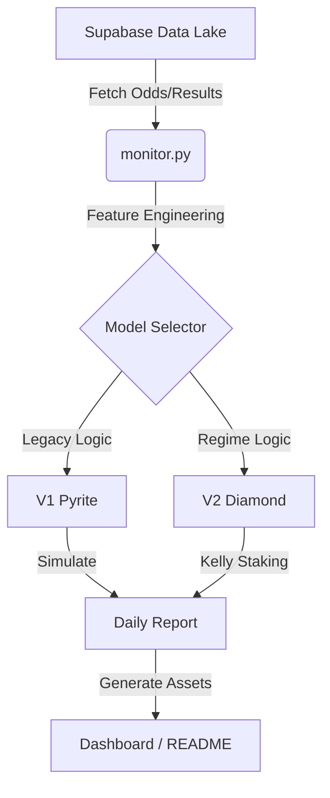

# XGBoost-Sniper: Quantitative Sports Trading System

[](https://www.python.org/downloads/release/python-3100/)
[](https://mypy.readthedocs.io/en/stable/)
[](https://opensource.org/licenses/MIT)

> **"The market is not efficient. It is just noisy."**

XGBoost-Sniper is an advanced, algorithmic trading system engineered to identify and exploit market inefficiencies in sports betting odds. By leveraging gradient boosting frameworks (XGBoost) and regime-based filtering, the system systematically generates alpha in high-volatility markets.

---

## 📊 Executive Performance

| Model | Strategy | Status | Daily Volume | ROI |
| :--- | :--- | :--- | :--- | :--- |
| **V1 Pyrite** | High-Variance / Volume | 🟡 Legacy | High (~139 bets/day) | **+13.4%** |
| **V2 Diamond** | Precision / Sniper | 🟢 **Active** | High (~68 bets/day) | **+13.7%** |
| **[V3 Obsidian](https://ducky705.github.io/XGBoost-Sniper/selector.html)** | Deep Learning / Hybrid | 🟣 **Alpha** | (Training) | **N/A** |

> [!IMPORTANT]
> **START HERE**: Access the [**Model Selector & Control Center**](https://ducky705.github.io/XGBoost-Sniper/selector.html).
>
> **Direct Links**:
> *   [Diamond Dashboard (Active)](https://ducky705.github.io/XGBoost-Sniper/diamond.html)
> *   [Obsidian Dashboard (Alpha)](https://ducky705.github.io/XGBoost-Sniper/obsidian.html)

---

## 🚀 The Evolution of Alpha

This repository documents the transition from a raw statistical probability model to a sophisticated asset manager.

### Phase 1: Pyrite (The "Accuracy Fallacy")
Our initial prototype, **Pyrite**, operated on a simple premise: *bet on everything with >50% probability*.
*   **Result**: While it achieved a 56.3% win rate, it lost money to the vigorish (fees) due to poor calibration on favorites.
*   **Lesson**: Accuracy ≠ Profitability.

### Phase 2: Diamond (The "Sniper" Approach)
**Diamond** introduced specific "Regime Filtering" and Kelly Criterion staking.
*   **Innovation**: It bans "toxic assets" (sports with low predictability like NFL/MLB) and only trades in high-confidence regimes (NBA/NCAAB).
*   **Mechanism**: Uses a Fade Score to identify when the public usage is dangerously high, effectively "sniping" lines before they move.

### Phase 3: Obsidian (The "Neural" Frontier)
**Obsidian** represents the next generation of predictive modeling, incorporating deep learning and hybrid architectures to capture non-linear relationships that decision trees might miss.
*   **Status**: Currently in Alpha testing.
*   **Access**: [Click here to view the Obsidian Dashboard](https://ducky705.github.io/XGBoost-Sniper/selector.html) (via Selector).

---

## 🛠 System Architecture



### Core Components
*   **`monitor.py`**: The central orchestration engine. Fetches data, runs inference, and commits results.
*   **`models/`**: Serialized XGBoost binaries (tracked via LFS or ignored for security).
*   **`docs/`**: Production-grade dashboards for visualizing model output.

---

## 🔒 Security & Privacy

This repository enforces strict security protocols:
*   **Credential Isolation**: All API keys are managed via `.env` and strictly excluded from version control.
*   **Model IP Protection**: Trained model artifacts (`.pkl`, `.model`) are strictly git-ignored.

---

## ⚡ Quick Start

### 1. Installation
```bash
git clone https://github.com/Ducky705/XGBoost-Sniper.git
cd XGBoost-Sniper
pip install -r requirements.txt
```

### 2. Configuration
Create a `.env` file with your credentials.

### 3. Run Inference
```bash
python monitor.py
```

---

*© 2025 XGBoost-Sniper Technologies. All rights reserved.*
