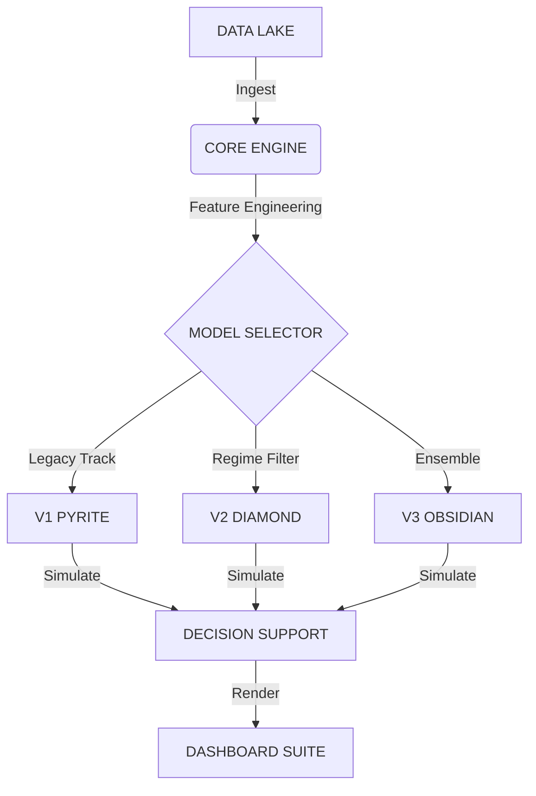

   
  <h1>THE QUARRY // XGB-SNIPER</h1>
  
ADVANCED ALGORITHMIC ARBITRAGE SYSTEM

   

  
  
  

   
   
  <a href="https://ducky705.github.io/XGBoost-Sniper/selector.html"><strong>ENTER CONTROL CENTER</strong></a>
   
   

---

## ⚡ EXECUTIVE INTELLIGENCE

A multi-generational algorithmic trading system leveraging **Gradient Boosting Decision Trees (XGBoost)** and **Deep Neural Networks** to identify inefficiencies in sports betting markets.

| MODEL ARCHITECTURE | RELEASED | STRATEGY PROFILE | STATUS | VOLUME | TOTAL BETS | ROI |
| :--- | :--- | :--- | :--- | :--- | :--- | :--- |
| **[V1 PYRITE](https://ducky705.github.io/XGBoost-Sniper/pyrite.html)** | `NOV 20, 2025` | `XGB-CLASSIC`   High-Frequency / Volatility Capture | 🟡 **LEGACY** | Very High (~196 bets/day) | **11013** | **+27.5%** |
| **[V2 DIAMOND](https://ducky705.github.io/XGBoost-Sniper/diamond.html)** | `NOV 30, 2025` | `XGB-HYBRID`   Precision / Regime Filtering | 🟢 **ACTIVE** | Very High (~96 bets/day) | **4438** | **+4.6%** |
| **[V3 OBSIDIAN](https://ducky705.github.io/XGBoost-Sniper/obsidian.html)** | `DEC 27, 2025` | `XGB-V3`   Non-Linear arbitrage | 🟣 **ALPHA** | Low (~6 bets/day) | **130** | **+14.6%** |

> [!IMPORTANT]
> **ACCESS PROTOCOL**: The primary interface for all models is the [**Model Selector**](https://ducky705.github.io/XGBoost-Sniper/selector.html).

---

## 🛰 SYSTEMS OVERVIEW

### V1 PYRITE // THE BRUTE FORCE
*The initial prototype.* Operated on raw probability differentials. While high-volume, it suffered from "false confidence" on heavy favorites.
*   **Verdict**: Profitable but volatile. Retired from primary rotation.

### V2 DIAMOND // THE SNIPER
*The current standard.* Introduces **Regime Filtering**—banning "toxic" low-predictability markets (NFL/MLB) and focusing on high-confidence setups (NBA/NCAAB).
*   **Mechanism**: Uses a Fade Score to identify public overexposure.
*   **Performance**: Consistent alpha generation with lower drawdown.

### V3 OBSIDIAN // THE ORACLE
*The next frontier.* An advanced ensemble hybrid designed to capture complex, non-linear dependencies that standard tree-based models miss.
*   **Status**: Currently ingesting data in shadow mode.

---

## 🛠 ARCHITECTURE

### COMPONENTS
*   `monitor.py`: Central command. Fetches data, executes inference pipelines, and commits artifacts.
*   `models/`: Serialized XGBoost binaries and neural weights.
*   `docs/`: Static visualization layer hosted on GitHub Pages.

---

    
<em>© 2025 XGBOOST-SNIPER TECHNOLOGIES // PROPRIETARY RESEARCH</em>

