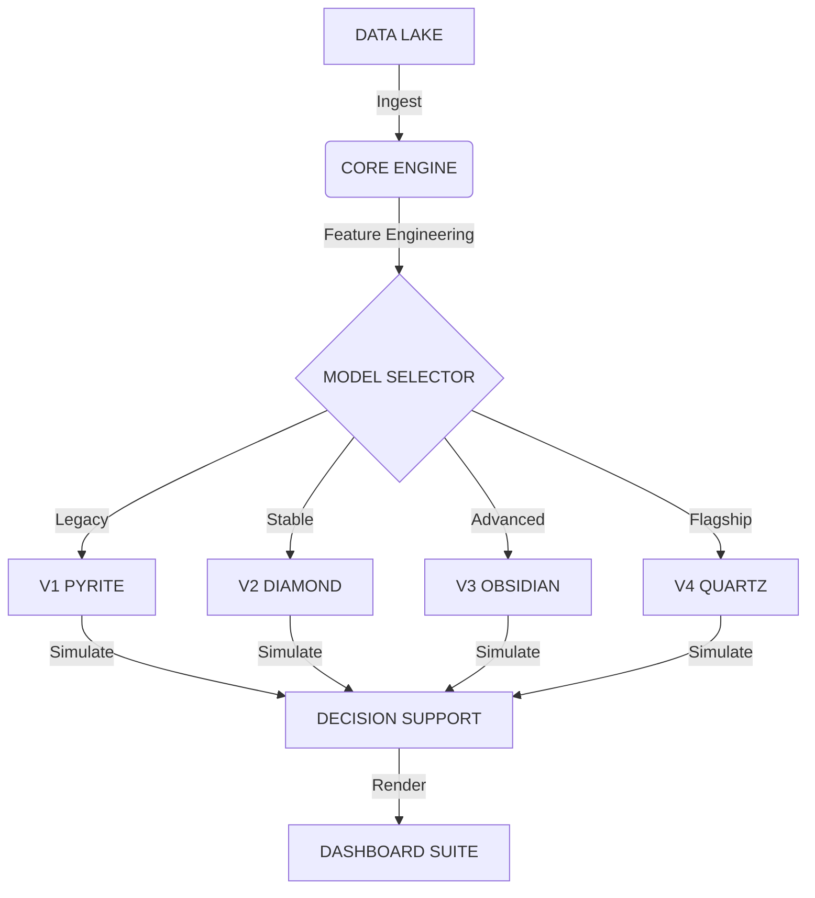

   
  <h1>THE QUARRY // XGB-SNIPER</h1>
  
ADVANCED ALGORITHMIC ARBITRAGE SYSTEM

   

  
  
  

   
   
  <a href="https://ducky705.github.io/XGBoost-Sniper/selector.html"><strong>ENTER CONTROL CENTER</strong></a>
   
   

---

## ⚡ EXECUTIVE INTELLIGENCE

A multi-generational algorithmic trading system leveraging **Gradient Boosting Decision Trees (XGBoost)** and **Deep Neural Networks** to identify inefficiencies in sports betting markets.

| MODEL ARCHITECTURE | RELEASED | STRATEGY PROFILE | STATUS | VOLUME | TOTAL BETS | ROI |
| :--- | :--- | :--- | :--- | :--- | :--- | :--- |
| **[V1 PYRITE](https://ducky705.github.io/XGBoost-Sniper/pyrite.html)** | `NOV 20, 2025` | `XGB-CLASSIC`   High-Freq | 🟡 **LEGACY** | High (~20 bets/day) | **2851** | **+62.4%** |
| **[V2 DIAMOND](https://ducky705.github.io/XGBoost-Sniper/diamond.html)** | `NOV 30, 2025` | `XGB-HYBRID`   Precision | 🟢 **STABLE** | High (~27 bets/day) | **3508** | **+8.0%** |
| **[V3 OBSIDIAN](https://ducky705.github.io/XGBoost-Sniper/obsidian.html)** | `DEC 27, 2025` | `DNN-ENSEMBLE`   Non-Linear | 🟣 **ADVANCED** | Medium (~12 bets/day) | **1224** | **+6.3%** |
| **[V4 QUARTZ](https://ducky705.github.io/XGBoost-Sniper/quartz.html)** | `APR 06, 2026` | `CORRECT SHIFT`   High-Fidelity | ⚪ **FLAGSHIP** | Low (~5 bets/day) | **11** | **+9.6%** |

> [!IMPORTANT]
> **ACCESS PROTOCOL**: The primary interface for all models is the [**Model Selector**](https://ducky705.github.io/XGBoost-Sniper/selector.html).

---

## 🛰 SYSTEMS OVERVIEW

### V4 QUARTZ // THE PRISM
*The latest flagship.* Utilizes **Correct Shift** logic to identify opening line inefficiencies across high-fidelity consensus pools.
*   **Mechanism**: Vectorized alpha harvesting with institutional drift proxy.
*   **Performance**: Targeting maximum stability and high recovery factor.

### V2 DIAMOND // THE SNIPER
*The institutional standard.* Focuses on **Regime Filtering** to avoid toxic low-predictability markets.
*   **Mechanism**: Uses a Fade Score to identify public overexposure.
*   **Performance**: Strong alpha generation with low drawdown.

---

## 🛠 ARCHITECTURE

```mermaid
graph TD
    A[DATA LAKE] -->|Ingest| B(CORE ENGINE)
    B -->|Feature Engineering| C{MODEL SELECTOR}
    C -->|Legacy| D[V1 PYRITE]
    C -->|Stable| E[V2 DIAMOND]
    C -->|Advanced| F[V3 OBSIDIAN]
    C -->|Flagship| G[V4 QUARTZ]
    D & E & F & G -->|Simulate| H[DECISION SUPPORT]
    H -->|Render| I[DASHBOARD SUITE]
```

---

    
<em>© 2026 XGBOOST-SNIPER TECHNOLOGIES // PROPRIETARY RESEARCH</em>

