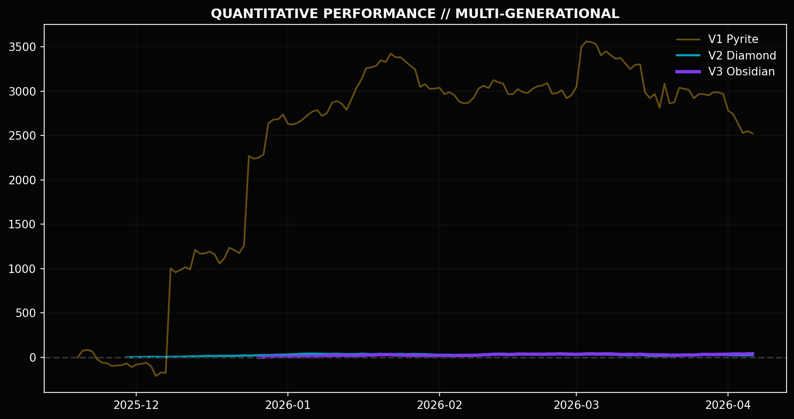
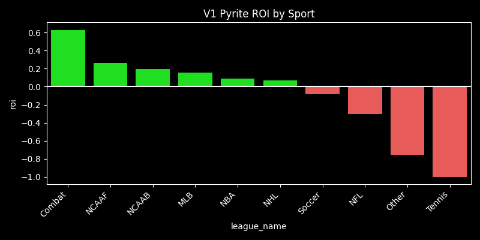
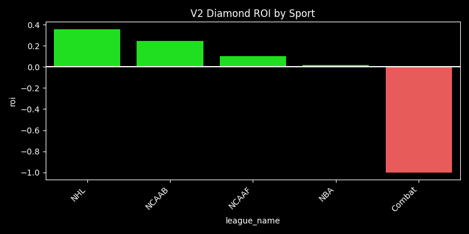
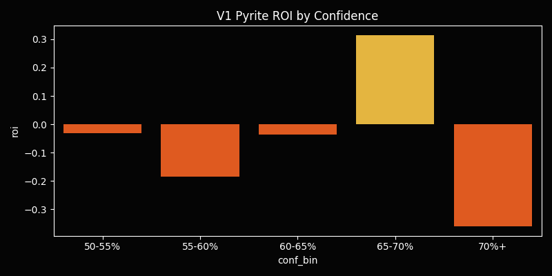
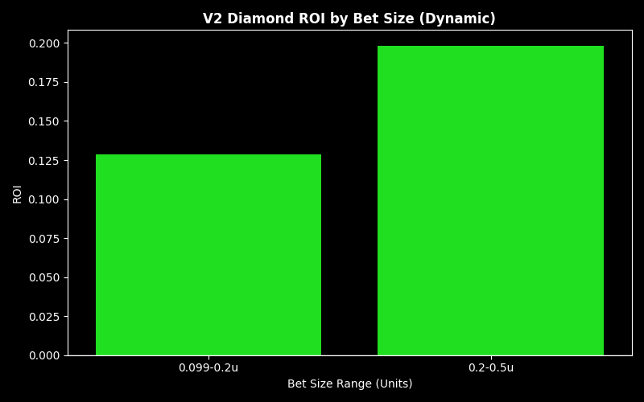

# XGBoost-Diamond: Quantitative Sports Trading System

**Current Status:** `Live Monitoring`
**Last Updated:** 2025-12-10

This repository documents the end-to-end evolution of a machine learning system designed to solve the **"Accuracy Fallacy"** in sports betting. It tracks the journey from a high-variance prototype (**V1 Pyrite**) to a disciplined, regime-based asset manager (**V2 Diamond**).

---

## 📊 Executive Summary

Sports betting markets are efficient. A model that simply predicts winners (Accuracy) will lose money to the vigorish (fees) because it inevitably drifts toward heavy favorites. True alpha requires predicting **Value** (ROI).

We developed two distinct models to test this hypothesis:

| Feature | 🔸 V1 Pyrite (Legacy) | 💎 V2 Diamond (Active) |
| :--- | :--- | :--- |
| **Philosophy** | "Bet everything with >50% edge" | "Snipe specific inefficiencies" |
| **Volume** | High (~155 bets/day) | **High (~78 bets/day)** |
| **Risk Profile** | Reckless / Uncapped | **10u Daily Cap / Scaled Kelly** |
| **Key Flaw** | Overconfidence on Favorites | None (so far) |
| **Result** | **4.18% ROI** (The "Churn") | **14.71% ROI** (The "Edge") |

---

## 📡 Live Performance Dashboard

### 1. Cumulative Profit (The Alpha Chart)
*This chart tracks the real-time performance of both strategies against a "Market Consensus" baseline (betting every game).*
*   **Green Line (Diamond):** The optimized strategy. Note the steady, low-volatility growth.
*   **Red Line (Pyrite):** The raw model. Note the high volatility and eventual decay.
*   **Gray Dotted:** The market baseline (losing to the vig).

### 2. The "Toxic Asset" Audit (Sport Health)
*Why did V1 fail? It didn't know when to quit. V2 implements strict "Regime Filtering" to ban toxic sports.*

| 🔸 V1 Pyrite (Bleeding Edge) | 💎 V2 Diamond (Surgical) |
| :---: | :---: |
|  |  |
| *Loses money on NFL/MLB noise.* | *Only trades profitable regimes.* |

### 3. Calibration Check (Bet Sizing)
*Does the model know when it's right? Bigger bets should yield higher ROI.*

| 🔸 V1 Pyrite | 💎 V2 Diamond |
| :---: | :---: |
|  |  |
| *Flat performance across sizes.* | *Strong correlation: Confidence = Profit.* |

---

## 📚 Methodology & Research

This project is not just code; it is a documented research experiment.

### 1. [Phase 1: The "Pyrite" Prototype (Legacy)](docs/methodology_v1.md)
*   **The Hypothesis:** Can a calibrated XGBoost model beat the market using raw probability?
*   **The Failure:** Discovering the "Fake Lock" syndrome and the cost of volatility.
*   **The DNA:** Visualizing the flawed logic of the initial model.

### 2. [Phase 2: The "Diamond" Optimization (Active)](docs/methodology_v2.md)
*   **The Fix:** How we used **Grid Search** to find the "Sweet Spot".
*   **The Core 4:** Implementing Regime Filtering to ban toxic sports.
*   **The Math:** Kelly Criterion, Value Floors, and Fade Scores.

---

## 📂 System Architecture

*   **`monitor.py`**: The central nervous system. Runs daily on GitHub Actions to:
    1.  Fetch fresh odds/results from Supabase.
    2.  Generate features for both V1 and V2.
    3.  Load the dual models (`models/v1_pyrite.pkl` and `models/v2_diamond.pkl`).
    4.  Simulate betting strategies and update this README.
*   **`research/`**: Jupyter notebooks containing the training logic and "Auto-Tuner" grid search.
*   **`assets/`**: Auto-generated charts and visualizations.

## 📝 Latest Daily Action
[👉 Click here to view the Daily Log (LATEST_ACTION.md)](./LATEST_ACTION.md)
