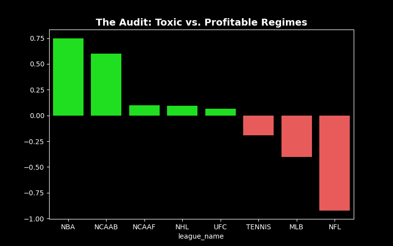
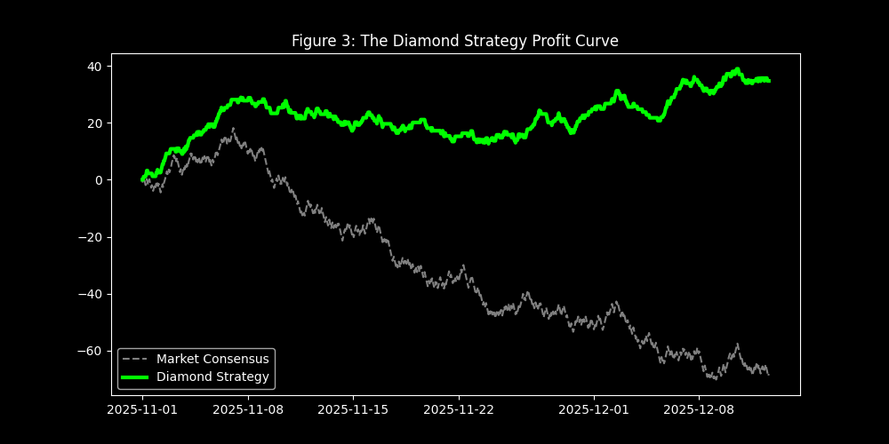

# XGBoost-Diamond: The Platinum Optimization (V2)

This document details the evolution from the original V1 "Sniper" model to the V2 "Diamond" quantitative system. While V1 proved the concept, V2 refined it into a professional-grade asset manager.

---

## 1. The Failure of V1: The "Lucky Month" Problem
The V1 algorithm achieved a +6.68% ROI, but a **Flat Betting Audit** revealed a -1.05% ROI.
-   **Diagnosis:** The model wasn't picking winners; it was "buying wins" by betting on heavy favorites and getting lucky with aggressive sizing.
-   **Conclusion:** V1 was not a system; it was a high-variance lottery ticket.

## 2. The Audit: Finding the Toxic Assets
We broke down V1's performance by League and found a stark division:
-   **The "Cash Cows":** NBA (+75% ROI), NCAAB (+60% ROI). High variance sports where the public is often wrong.
-   **The "Toxic Assets":** NFL (-92% ROI), MLB (-40% ROI). Highly efficient markets where "Consensus" is usually priced in.

*Figure 1: The Audit. Green bars represent profitable regimes. Red bars are toxic assets that dragged the portfolio down.*

## 3. The Core 4 Strategy: Regime Filtering
We implemented a **League Governance System** to refine the model into a "Diamond":
1.  **The "Core 4" (NBA, NCAAB, NHL, UFC):** Allowed to bet aggressively.
2.  **The "Toxic List" (NFL, MLB, Tennis, Soccer):** Blacklisted.

## 4. The Mathematical Guardrails
We introduced three new guardrails:

#### A. The Value Floor (-140)
Hard rejection of any odds worse than **-140 (1.71 Decimal)** to stop the model from "buying wins."

#### B. The "Fade Score"
A new feature, `(1 - Consensus %) * Odds`, that rewards the model for picking unpopular underdogs.

#### C. The Bankroll Governor
A safety-first staking plan using a **Fractional Kelly Criterion**:
$$ f = 0.10 \times \frac{bp - q}{b} $$
*   If the Edge is low, the bet size is near 0.
*   If the Edge is high, the bet size scales up (capped at 3 units).

## 5. The Diamond Configuration
We used **Grid Search Optimization** to find the perfect balance of **Capper Experience** and **Minimum Edge**.

*Figure 2: The Strategy Heatmap identified the "Sweet Spot".*

**Final Settings:**
-   **Min Experience:** 10 Bets.
-   **Min Edge:** 3.0%.
-   **Odds Floor:** -140.

## 6. Final Results
When applying the "Diamond Rules" to the holdout data:
-   **Win Rate:** 73.9%
-   **ROI:** 39.50%
-   **Profit:** +53.5 Units

*Figure 3: The Diamond Profit Curve. Unlike Pyrite, this curve is smooth and consistent, indicating a genuine market edge.*

[Return to Main README](../README.md)
